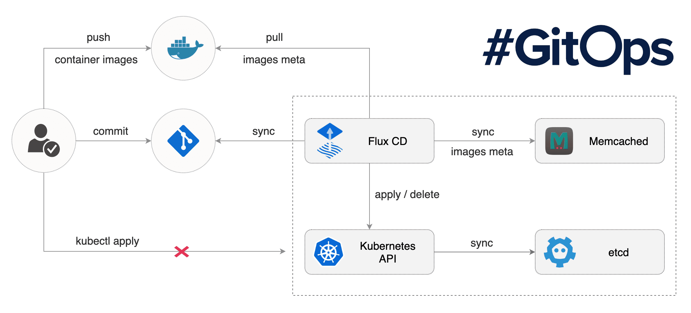

# Cluster Provisioning

This lab walks your through provisioning a secure AKS cluster utilizing Terraform. We will use Terraform to deploy the cluster and Weaveworks Flux to provide some post provisioning of resources, so we we can automate the entire provisioning and post-provisioning needed to have a production cluster.

You may ask "Why not utilize Azure Resource Manger Templates?"... The reason we have utilized Terraform is that it gives a multi-platform provisioning tool, that also lets us automate the provisioning of non-Azure resource, so we'll have a full production cluster setup from a single provisioning tool.

We will first need to setup all our variables from the last lab, so we can utilize the networking infrastructure that was setup.

```bash
export TF_VAR_prefix=$PREFIX
export TF_VAR_resource_group=$RG
export TF_VAR_location=$LOC
export TF_VAR_client_id=$APPID
export TF_VAR_client_secret=$PASSWORD


export TF_VAR_github_organization=Azure
export TF_VAR_github_token=<ask_instructor>
export TF_VAR_azure_subnet_id=$(az network vnet subnet show -g $RG --vnet-name $VNET_NAME --name $AKSSUBNET_NAME --query id -o tsv)
export TF_VAR_aad_server_app_id=<ask_instructor>
export TF_VAR_aad_server_app_secret=<ask_instructor>
export TF_VAR_aad_client_app_id=<ask_instructor>
export TF_VAR_aad_tenant_id=<ask_instructor>
```

Now that we have all of our variables stored we can initialize Terraform.

First ensure you are in the Terraform directory

```bash
cd cluster-provisioning/terraform
```

Now initialize Terraform with the following command:

```bash
terraform init
```

This command is used to initialize a working directory containing Terraform configuration files. This is the first command that should be run after writing a new Terraform configuration or cloning an existing one from version control. It is safe to run this command multiple times.

Now that we have initialized our terraform directory, we will want to run a `terraform plan`. The `terraform plan` command is a convenient way to check whether the execution plan for a set of changes matches your expectations without making any changes to real resources or to the state. For example, terraform plan might be run before committing a change to version control, to create confidence that it will behave as expected.

```bash
terraform plan
```

After running this command you'll see output like the following that will show what is going to be provisioned.

```bash
add example output
```

Now that we have verified what will be deployed we can execute the `terraform apply` command, which will provision all our resources to Azure.

```bash
terraform apply
```

***This will take approximately 10-15 minutes to fully provision all of our resources***

In the next section we will talk about our approach to automating the setup, that is typically done in a post install setup. We utilize Flux that automatically syncs our Kubernetes manifest from a Github repo.

## GitOps Approach To Managing Clusters

GitOps was popularized by the folks at Weaveworks, and the idea and fundamentals
were based on their experience of running Kubernetes in production. GitOps takes
the concepts of the software development life cycle and applies them to operations.
With GitOps, your Git repository becomes your source of truth, and your cluster is
synchronized to the configured Git repository. For example, if you update a Kubernetes
Deployment manifest, those configuration changes are automatically reflected
in the cluster state.

By using this method, you can make it easier to maintain multiple clusters that are consistent
and avoid configuration drift across the fleet of deployed clusters. GitOps allows you to declaratively
describe your clusters for multiple environments and drives to maintain that
state for the cluster. The practice of GitOps can apply to both application delivery and
operations, but in this chapter, we focus on using it to manage clusters and operational
tooling.

Weaveworks Flux was one of the first tools to enable the GitOps approach, and it’s the
tool we will use due to it's maturity and level of adoption. Below is a diagram that describes how the approach works.


