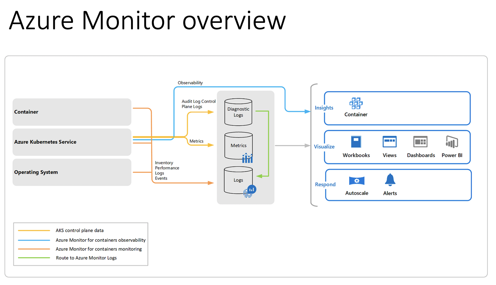
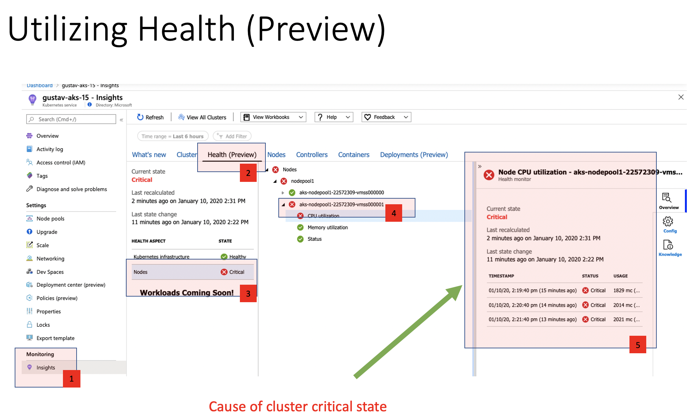
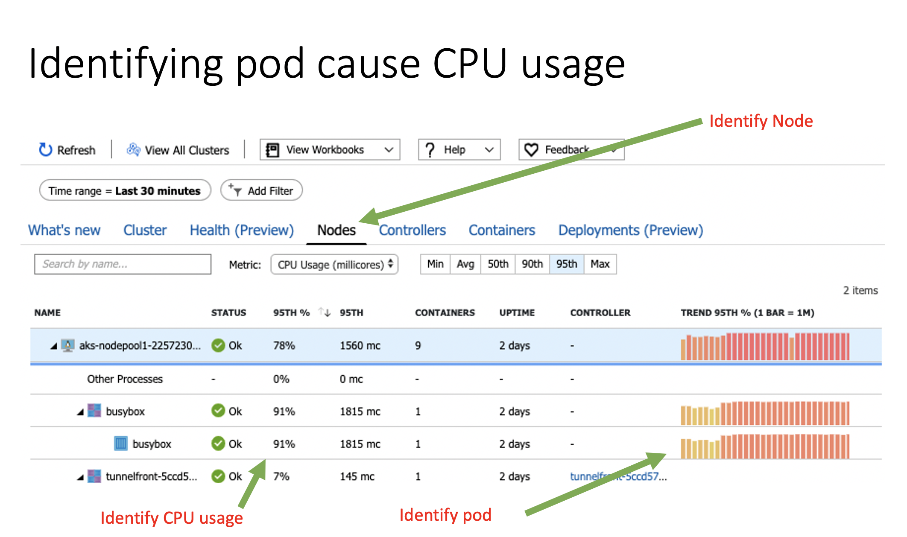
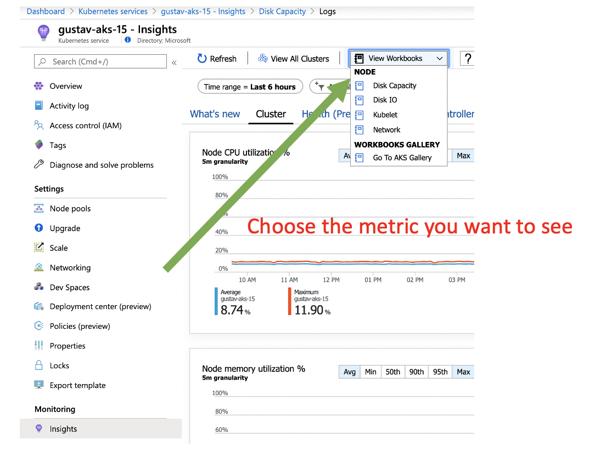
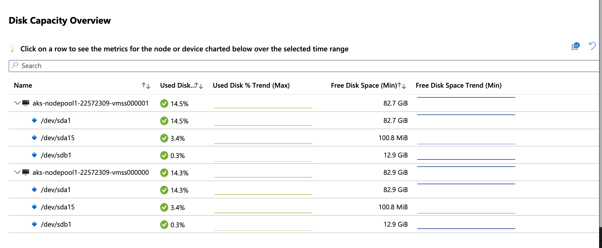
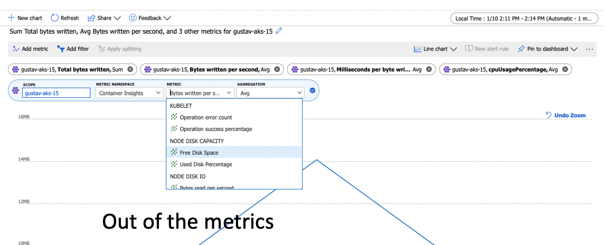
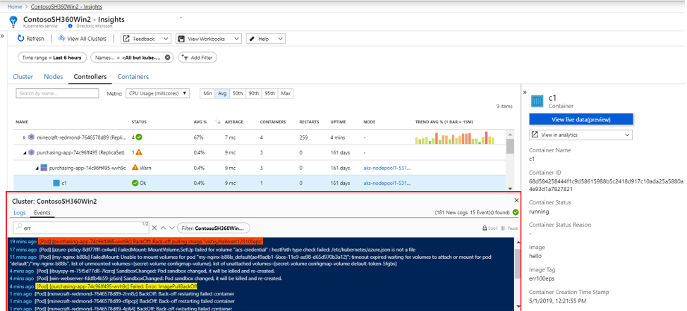
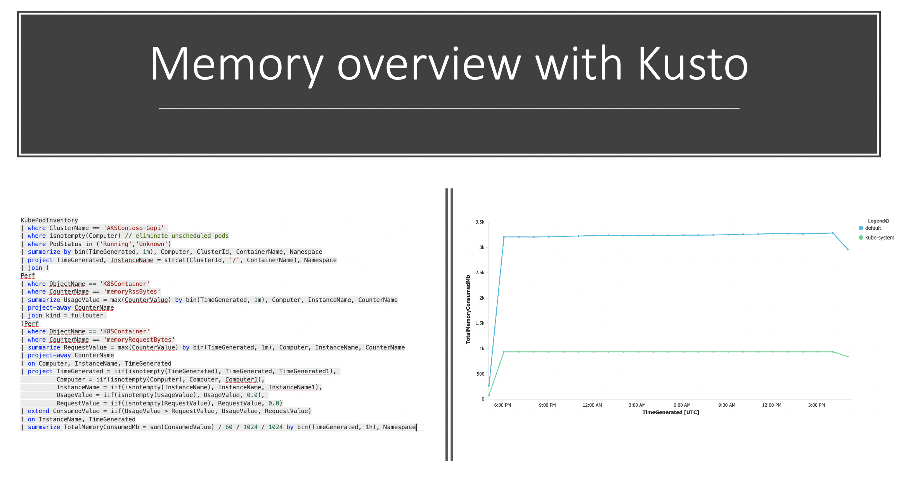
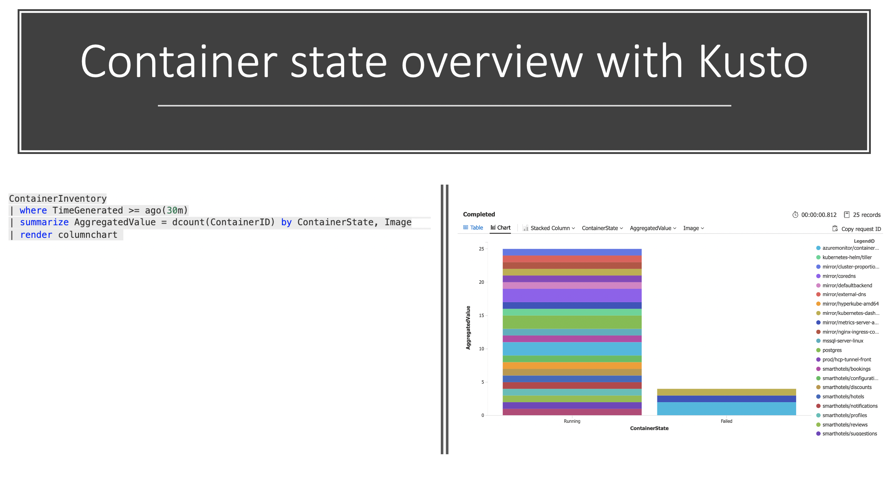

# Day2 Operations

This section walks us through the key considerations that need to be taken into account when thinking about how to operate AKS after everything is provisioned and running. In this section we will cover the following topic:

- GitOps
- Upgrading Your Cluster
- Resource Management
- Scaling
  - Cluster Scaling
  - Application Scaling
- Daily Monitoring
- Logging
- Alerting
- Backup/DR

We will implement some of the topics throughout this lab where others we will talk about the different approaches you can use for day 2 Operations.

## GitOps Approach For Managing Multiple Clusters

GitOps was popularized by the folks at Weaveworks, and the idea and fundamentals were based on their experience of running Kubernetes in production. GitOps takes the concepts of the software development life cycle and applies them to operations. With GitOps, yourGit repository becomes your source of truth, and your cluster is synchronized to the configured Git repository. For example, if you update a Kubernetes Deployment manifest, those configuration changes are automatically reflected in the cluster state.

By using this method, you can make it easier to maintain multiple clusters that are consistent and avoid configuration drift across the fleet.GitOps allows you to declaratively describe your clusters for multiple environments and drives to maintain that state for the cluster.The practice of GitOps can apply to both application delivery and operations, but in this chapter, we focus on using it to manage clusters and operational tooling.

Weaveworks Flux was one of the first tools to enable the GitOps approach, and it’s the tool we will use throughout the rest of the chapter. There are many new tools that have been released into the cloud-native ecosystem that are worth a look, such as Argo CD, from the folks at Intuit, which has also been widely adopted for the GitOps approach.


If you remember back in the __Cluster Provisioning__ section we talked about how we used Flux to bootstrap components when we provisioned the cluster. To demonstrate how the cluster synchronizes with our git repo we will delete one of the namespaces and see how it automatically gets synchronized back to the state that is stored in Github.

<<<<<<< HEAD
First list the namespace to see which ones were configured from our git repo.

=======
>>>>>>> a86acd8597c0fcc245ab3a8235733ffab457ae92
```bash
# First list the namespace to see which ones were configured from our git repo.
kubectl get ns

# Now we'll delete one of the namespaces.
kubectl delete ns dummy-ns

# If you run the following command you'll see that the dummy-ns namespace is no longer listed.
kubectl get ns

# Now if you watch the namespace you will see it automatically appear after about 1 minutes (Sync time is configurable).
kubectl get ns -w
```

## Resource Management

One of the important task of day 2 operations is resource management. Resource Management consist of maintaining adequate resources to serve your workloads. Kubernetes provides built in mechanisms to provide both soft and hard limits on CPU and Memory. It's important to understand how these request and limits work as it will ensure you provide adequate resource utilization for your cluster.

__Requests__ are what the container is guaranteed to get. If a container requests a resource then Kubernetes will only schedule it on a node that satisfies the request. __Limits__, on the other hand, ensure a container never goes above a certain configured value. The container is only allowed to go up to this limit, and then it is restricted.

When a container does hit the limit there is different behavior from when it hits a memory limit vs a CPU limit. With a memory limit the container will be killed and you'll see an "Out Of Memory Error". When a CPU limit is hit it will just start throttling the CPU vs restarting the container.

It's also important to understand how Kubernetes assigns QoS classes when scheduling pods, as it hav an effect on pod scheduling and eviction. Below is the different QoS classes that can be assigned when a pod is scheduled:

- **QoS class of Guaranteed:**
  - Every Container in the Pod must have a memory limit and a memory request, and they must be the same.
  - Every Container in the Pod must have a CPU limit and a CPU request, and they must be the same.
  
- **QoS class of Burstable**
  - The Pod does not meet the criteria for QoS class Guaranteed.
  - At least one Container in the Pod has a memory or CPU request.

- **QoS class of Best Effort**
  - For a Pod to be given a QoS class of BestEffort, the Containers in the Pod must not have any memory or CPU limits or requests.

Below shows a diagram depicting QoS based on request and limits.


**Failure to set limits for memory on pods can lead to a single pod starving the cluster of memory.**

If you want to ensure every pod get at least a default request/limit, you can set a **LimitRange** on a namespace. If you preform the following command you can see in our cluster we have a LimitRange set on the Dev namespace.

```bash
# Check Limit Ranges in Dev Namespace
kubectl get limitrange dev-limit-range -n dev -o yaml
```

**You'll see that we have the following defaults:**

```yaml
- Request
  - CPU = 250m
  - Memory = 256Mi

- Limit
  - CPU = 500m
  - Memory = 512Mi
```

**It can't be stated enough of the importance of request and limits to ensure you cluster is in a healthy state. You can read more on these topics in the **Key Links** at the end of this lab.**

## Scaling Resources

## Logging And Alerts

__Azure Monitor for Containers__ allows you to collect metrics, live logs, and logs for investigative purposes. Monitoring and logging the health and performance of your Azure Kubernetes Service (AKS) cluster is important to ensure that your applications are up and running as expected. It's first important to understand the difference between __Logs__ and __Metrics__. Both serve difference purposes and are components of observability.

- Metrics - Typically a time series of numbers over a specific amount time
- Logs - Used for exploratory analysis of a system or application

The following screenshot describes how monitoring can be done.





By clicking the Nodes tab in under Insights it also gives you the possibility to drill down the tree and expand nodes that where you might have a pod running high on CPU. In this case i 'forgot' to add limits in my manifest file during the busybox pod creation and is now using all the CPU it is asking for.



//TODO:
Low Disk Space

Monitoring disk space a critical part of keeping any Kubernetes cluster alive. Enabling and selecting workbooks you get a out of box dashboard that can help you.



Here is an example of disk capacity


Disk throttling 

From the Insights portal you can also view the node disk capacity. 



Here is an example of bytes being written per sec.


In the next section we'll dive into how to view live logs, create log query, and how to create an alert from the query.

## Live Logs

Live logs are nice way to see logs being emitted from STDOUT/STDERR of a container. You can give developers access to the live logging, so they can live debug issues happening with their application. This allows you to limit their exposure to using __kubectl__ for application issues.

To access the live logs you will need to navigate to the Insights section of the AKS Cluster

Portal->Azure Kubernetes Service->Cluster->Insights



This is a great way of identifying error messages.

[Navigation](./imglivelogsnav.png)

Now in Insights

### Creating Alerts Based on Log Query

Microsoft uses a query language called Kusto, which can be used to create dashboards based on a query. The following screenshot describes these functions and how to use them:


Now if we want to create a custom kusto query we can do the following search, but remember to change the clustername:

```bash
// **************************
// CPU consumption
// **************************
KubePodInventory
| where ClusterName == **change-me-to-my-clustername** 
| where isnotempty(Computer) // eliminate unscheduled pods
| where PodStatus in ('Running','Unknown')
| summarize by bin(TimeGenerated, 1m), Computer, ClusterId, ContainerName, Namespace
| project TimeGenerated, InstanceName = strcat(ClusterId, '/', ContainerName), Namespace
| join (
Perf
| where ObjectName == 'K8SContainer'
| where CounterName == 'cpuUsageNanoCores'
| summarize UsageValue = max(CounterValue) by bin(TimeGenerated, 1m), Computer, InstanceName, CounterName
| project-away CounterName
| join kind = fullouter 
(Perf
| where ObjectName == 'K8SContainer'
| where CounterName == 'cpuRequestNanoCores'
| summarize RequestValue = max(CounterValue) by bin(TimeGenerated, 1m), Computer, InstanceName, CounterName
| project-away CounterName
) on Computer, InstanceName, TimeGenerated
| project TimeGenerated = iif(isnotempty(TimeGenerated), TimeGenerated, TimeGenerated1), 
          Computer = iif(isnotempty(Computer), Computer, Computer1),
          InstanceName = iif(isnotempty(InstanceName), InstanceName, InstanceName1),
          UsageValue = iif(isnotempty(UsageValue), UsageValue, 0.0), 
          RequestValue = iif(isnotempty(RequestValue), RequestValue, 0.0)
| extend ConsumedValue = iif(UsageValue > RequestValue, UsageValue, RequestValue)
) on InstanceName, TimeGenerated
| summarize TotalCpuConsumedCores = sum(ConsumedValue) / 60 / 1000000 by bin(TimeGenerated, 1h), Namespace
```

If we run that query with the changed clustername you should see something a la the following. In case you have multi namespaces it will also be shown.


Here is another example where we do it based on Memory per namespace



Often we also want to create an easy way to see the state of running pods; for example if they are running or failed.

The following kusto query gives you the following:

```bash
ContainerInventory
| where TimeGenerated >= ago(30m)
| summarize AggregatedValue = dcount(ContainerID) by ContainerState, Image
| render columnchart
```



- SSH into Pod

## Metrics

- Low Disk Space
- Disk throttling

## Cluster Upgrade With Node Pools

With nodepools available in AKS, we have the ability to decouple the Control Plane upgrade from the nodes upgrade, and we will start by upgrading our control plane. 

**Note** Before we start, at this stage you should:
1- Be fully capable of spinning up your cluster and restore your data in case of any failure (check the backup and restore section)
2- Know that control plane upgrades don't impact the application as its running on the nodes
3- You know that your risk is a failure on the Control Plane and in case this happened you should go and spin up a new cluster and migrate then open a support case to understand what went wrong.

```bash
az aks upgrade -n ${PREFIX}-aks -g $RG -k 1.15.7 --control-plane-only

Kubernetes may be unavailable during cluster upgrades.
Are you sure you want to perform this operation? (y/n): **y**
Since control-plane-only argument is specified, this will upgrade only the control plane to 1.14.8. Node pool will not change. Continue? (y/N): **y**
{
  "aadProfile": null,
  "addonProfiles": null,
  "agentPoolProfiles": [
    {
      "availabilityZones": null,
      "count": 1,
      "enableAutoScaling": null,
      "enableNodePublicIp": null,
      "maxCount": null,
      "maxPods": 110,
      "minCount": null,
      "name": "node1311",
      "nodeTaints": null,
      "orchestratorVersion": "1.14.7",
      "osDiskSizeGb": 100,
      "osType": "Linux",
      "provisioningState": "Succeeded",
      "scaleSetEvictionPolicy": null,
      "scaleSetPriority": null,
      "type": "VirtualMachineScaleSets",
      "vmSize": "Standard_DS2_v2",
      "vnetSubnetId": null
    }
  ],
  "apiServerAccessProfile": null,
  "dnsPrefix": "aks-nodepo-ignite-2db664",
  "enablePodSecurityPolicy": false,
  "enableRbac": true,
  "fqdn": "aks-nodepo-ignite-2db664-6e9c6763.hcp.eastus.azmk8s.io",
  "id": "/subscriptions/2db66428-abf9-440c-852f-641430aa8173/resourcegroups/ignite/providers/Microsoft.ContainerService/managedClusters/aks-nodepools-upgrade",
  "identity": null,
  "kubernetesVersion": "1.15.7",
 ....
```

**Note** The Control Plane can support N-2 kubelet on the nodes, which means 1.15 Control Plane supports 1.14, and 1.12 Kubelet. Kubelet can't be *newer* than the Control Plane. more information can be found [here](https://kubernetes.io/docs/setup/release/version-skew-policy/#kube-apiserver)

Lets add a new node pool with the desired version "1.15.7"

```bash
az aks nodepool add \
    --cluster-name ${PREFIX}-aks \
    --resource-group $RG \
    --name nodepoolblue \
    --node-count 4 \
    --node-vm-size Standard_DS3_v2 \
    --kubernetes-version 1.15.7

# Lets check our nodepools
kubectl get nodes
```

```bash
NAME                               STATUS   ROLES   AGE   VERSION
aks-node1311-64268756-vmss000000   Ready    agent   40m   v1.15.7
aks-node1418-64268756-vmss000000   Ready    agent   75s   v1.14.7
```

TEST TEST TEST, in whatever way you need to test to verify that your application will run on the new node pool, normally you will spin up a test version of your application, if things are in order then proceed to moving workloads

Now we will need to taint the existing nodepool, so no new workloads are scheduled while we migrate workloads to the new nodepool.

```bash
kubectl taint node aks-agentpool-31778897-vmss000000 aks-agentpool-31778897-vmss000001 aks-agentpool-31778897-vmss000002 upgrade=true:NoSchedule
```

Now the nodes are tainted we can now drain each node to move the workloads over to the upgraded node pool.

```bash
kubectl drain aks-agentpool-31778897-vmss000000 --ignore-daemonsets --delete-local-data
```

**You will need to drain each node in the pool for all workloads to move over to the new nodepool.**

Check if the pods are running, note that all the new pods are in the new nodepool. You will see DameonSets we ignored still running on those initial nodes.

```bash
kubectl get pods -o wide
```

```bash
NAME                                     READY   STATUS    RESTARTS   AGE    IP             NODE                                   NOMINATED NODE   READINESS GATES
linkerd-controller-6d6cb84b49-f8kdc      3/3     Running   4          2m3s   100.64.1.205   aks-nodepoolblue-31778897-vmss000003   <none>           <none>
linkerd-destination-56487475c4-xtr8k     2/2     Running   2          2m4s   100.64.1.212   aks-nodepoolblue-31778897-vmss000003   <none>           <none>
linkerd-identity-64f89c776f-r6v46        2/2     Running   2          2m4s   100.64.1.102   aks-nodepoolblue-31778897-vmss000000   <none>           <none>
linkerd-proxy-injector-5956d6ffb-5h44l   2/2     Running   2          2m3s   100.64.1.197   aks-nodepoolblue-31778897-vmss000003   <none>           <none>
linkerd-sp-validator-747dcd685c-swsp9    2/2     Running   2          2m4s   100.64.1.218   aks-nodepoolblue-31778897-vmss000003   <none>           <none>
```

## Next Steps

[Service Mesh](/service-mesh/README.md)

## Key Links

- [Setup Alerts for Performance Problems with Azure Monitor for Containers](https://docs.microsoft.com/en-us/azure/azure-monitor/insights/container-insights-alerts)
